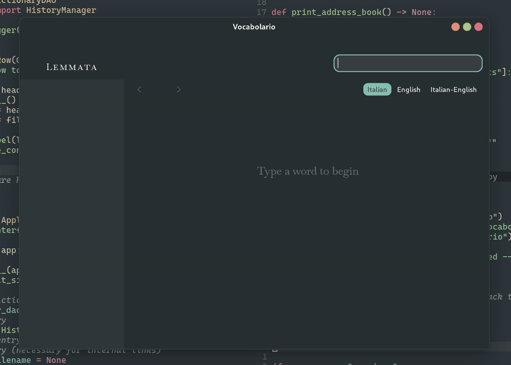
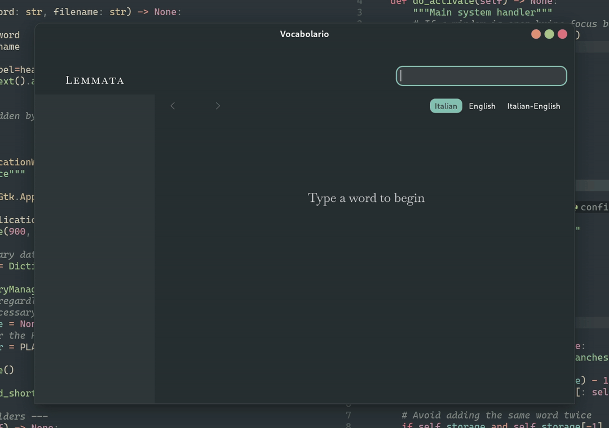
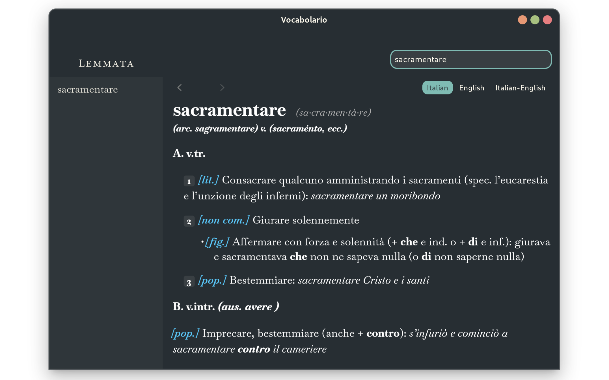
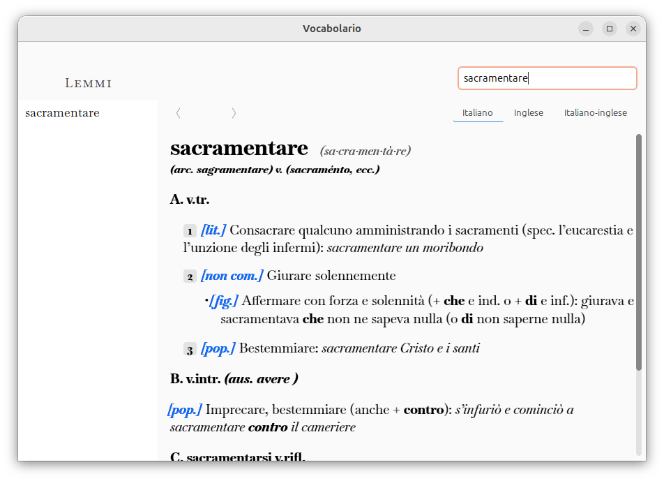

<div align="center">

<h1>Vocabolario</h1>
<p>
  <strong>A blazing-fast, butter-smooth dictionary with a polished GTK 3 interface.</strong>
</p>

<p>
  
  
  
  
</p>


</div>

## Overview

Vocabolario is a lightweight dictionary written in Python, with components in CSS and JavaScript. It reads entry files in HTML indexed in an SQLite database. For ideas on how to obtain the HTML files check out [PyGlossary](https://github.com/ilius/pyglossary/tree/master) and [appledict2semantic](https://github.com/yell0wsuit/appledict2semantic). Shout-out to [Zafiro Icons](https://github.com/zayronxio/Zafiro-icons/tree/master) for the amazing logo design!

## Goals of the Project
1. Curating and deploying an application from start to finish, from the first CLI prototype to the final `.deb` package.
2. Designing a beautiful user interface with no bloat.
3. Understanding the inner workings of the GTK ecosystem and Debian packaging.
4. I desperately needed a dictionary to write my dissertation.

## Features
- **Live preview:** see results as you type
- **Lightning fast:** database queries managed by SQLite
- **Native feel:** seamless integration with GNOME
- **Maximum compatibility:** written in GTK 3 and WebKit2 
- **Theme-aware:** it adapts to both light and dark themes (see screenshots)
- **Browsing history:** move backward or forward in your viewing history
- **Limitless styling options:** each dictionary can be styled with CSS and JavaScript injections
- **Robust logging:** logging library implemented across modules
- **Dynamic interface:** config files govern the construction of the window
- **Modular design:** each module is charged with one and one task only
- **Easily extendable:** any number of dictionaries can be added
- **Profusely commented:** to reflect my learning process

## Technologies
- Python3
- SQLite
- CSS and JavaScript

## Structure
```text
Vocabolario/
├── assets/             # Icons, CSS, and HTML templates
├── data/               # Catalog of dictionaries, dictionary files
├── logs/               # Log files (limit: 1.5 MB)
├── scripts/            # Database builders and utility tools
├── src/
│   ├── main.py         # Application entry point
│   ├── ui.py           # Window and Widget construction
│   ├── database.py     # DAO (Data Access Object) layer
│   ├── history.py      # History management logic
│   └── config.py       # Configuration and Path management
├── tests/              # Test units
└── README.md
```
## Setup
Clone the repo, then install dependencies:
```bash
sudo apt install python3-gi gir1.2-gtk-3.0 gir1.2-webkit2-4.1
```
(They will most likely be already installed if you're using a Debian-based distro with GNOME)
Run the app from source:
`python3 src/main.py`
Make sure to have your own collection of HTML entries, and to run the database_builder scripts that you can find in `scripts/`.

NOTE: Dictionary entries not provided


## Screenshots
<div align="center">

<p><i>The ultra-fast user interface</i></p>

<p><i>Vocabolario on a dark theme</i></p>

<p><i>Vocabolario on a light theme (Ubuntu Yaru), Italian version</i></p>
</div>

#
<div align="center">
<p align="center">Tested on Debian 13 "Trixie", and Ubuntu 25.10</p>
</div>
